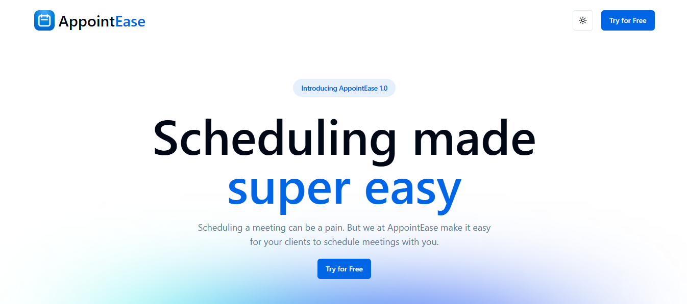
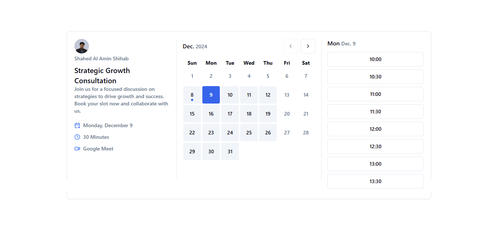

# AppointEase

AppointEase is a modern, user-friendly appointment scheduling application designed to streamline event management, availability tracking, and meeting organization. Built with a cutting-edge tech stack, AppointEase offers a seamless user experience and professional features for individuals and businesses. [🔗 Live Link](https://appoint-ease-eta.vercel.app)

## Features

### Landing Page

- Polished and responsive design with the following sections:
  - **Navbar**
  - **Hero Section**
  - **Trusted by the Best Companies**
  - **Features Overview**
  - **Testimonials**
  - **Call to Action**

### Authentication

- Secure login powered by **NextAuth**.
- Social authentication via **Google** and **GitHub**.
- Post-login profile setup with username and full name configuration.
- Calendar synchronization through **Nylas**.

### Dashboard

Organized into four main sections:

1. **Event Type**:

   - Create events with:
     - Title, slug, description, and duration.
     - Video call provider selection (Zoom, Google Meet, Microsoft Teams).
   - Manage events:
     - Update or delete events.
     - Preview event details.
     - Set events as active/inactive.
     - Copy sharable event URLs.

2. **Availability**:

   - Set active/inactive days for scheduling.
   - Define and update available time slots.

3. **Meetings**:

   - View all booked meetings.
   - Join meetings via provided links.
   - Cancel meetings when needed.

4. **Settings**:

   - Update profile information (name and profile image).

5. **Theme**:
   - Toggle between **Light** and **Dark** themes for a personalized experience.

### Tech Stack

- **Frontend**: Next.js, React, Tailwind CSS, ShadCN UI, TypeScript
- **Backend**: Prisma, Supabase, Nylas
- **Authentication**: NextAuth (Google and GitHub OAuth)
- **Additional Tools**: date-fns, react-aria-components, UploadThing, Zod

---

## Installation

1. Clone the repository:

   ```bash
   git clone https://github.com/shihab01118/AppointEase
   cd AppointEase
   code .
   ```

2. Install dependencies:

   ```bash
   npm install
   ```

3. Set up environment variables

   - Create a .env file in the root directory.
   - Add the following variables:

     ```code
     AUTH_SECRET=your_app_auth_secret

     AUTH_GITHUB_ID=your_github_app_auth_id
     AUTH_GITHUB_SECRET=your_github_app_auth_secret

     AUTH_GOOGLE_ID=your_google_app_auth_id
     AUTH_GOOGLE_SECRET=your_google_app_auth_secret

     DATABASE_URL=your_database_url_from_supabase
     DIRECT_URL=your_direct_url_from_supabase

     NYLAS_API_SECRET_KEY=your_nylas_api_secret_key
     NYLAS_API_URI=your_nylas_api_uri
     NYLAS_CLIENT_ID=your_nylas_client_id

     NEXT_PUBLIC_URL=http://localhost:3000(to run locally)

     UPLOADTHING_TOKEN=your_uploadthing_token(for image uploading)
     ```

4. Run the development server:
   ```bash
   npm run dev
   ```
5. Open the browser and navigate to [http://localhost:3000](http://localhost:3000)

## Usage

1. Log in using Google or GitHub.
2. Complete the profile setup and connect with Nylas for calendar synchronization.
3. Use the dashboard to:
   - Manage events.
   - Set availability.
   - View and join meetings.
   - Update profile settings.

## Screenshots

Here are some screenshots showcasing the key features of AppointEase:

1. **Landing Page**

   

2. **Event Type Page**

   

3. **Create Event Page**

   

4. **Meeting Preview Page**

   

5. **Availability Settings**

   

6. **Meetings Page**

   

7. **Meetings Page**

   

## Contributing

Contributions are welcome! Please follow the steps below:

1. Fork the repository.
2. Create a feature branch: `git checkout -b branch-name`
3. Commit your changes: `git commit -m "Add some feature"`
4. Push to the branch: `git push origin branch-name`
5. Open a pull request.

## Contact

For any questions or feedback, feel free to reach out:

- **Email:** [shahed.shihab.0@gmail.com](shahed.shihab.0@gmail.com)
- **GitHub:** [shihab01118](https://github.com/shihab01118)

**AppointEase** - Simplify your scheduling today!
